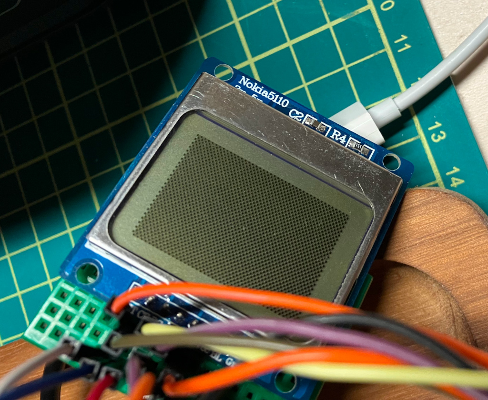
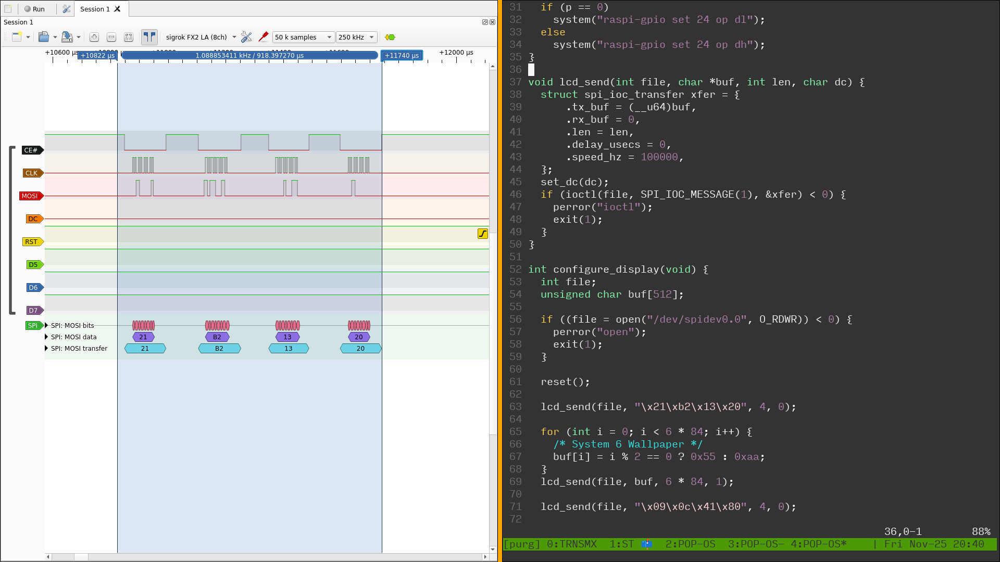

Nokiar
======

Just a basic bit of Linux C to drive the kernel SPI driver enough to get pixels onto a PCD8544 display (commonly called the Nokia 5110 Display).

I was able to refer back to code I wrote in Forth(!) in 2016(!) to help. Thanks, [past Aaron][pa].

Despite being quite a short program, this took hours of debugging and I ended up having to break out a signal analyzer. I made numerous simple errors throughout, but a special shout out goes to confusing GPIO pin numbers with P1 header pin numbers _more than once_.

I shell out to `raspi-gpio` for the non-SPI parts. It seems in 2022 my options for doing this in C without forking mostly relate to poking inside `/proc/mem` or importing a big library that defeats what I'm trying to do (lower level C development).

[pa]: https://github.com/insom/embello/commit/e15afaf507927f38975ba7fe730cc08641fe0a35

License
-------

Copyright (c) 2022, Aaron Brady

Permission is hereby granted, free of charge, to any person obtaining a copy
of this software and associated documentation files (the "Software"), to deal
in the Software without restriction, including without limitation the rights
to use, copy, modify, merge, publish, distribute, sublicense, and/or sell
copies of the Software, and to permit persons to whom the Software is
furnished to do so, subject to the following conditions:

The above copyright notice and this permission notice shall be included in
all copies or substantial portions of the Software.

THE SOFTWARE IS PROVIDED "AS IS", WITHOUT WARRANTY OF ANY KIND, EXPRESS OR
IMPLIED, INCLUDING BUT NOT LIMITED TO THE WARRANTIES OF MERCHANTABILITY,
FITNESS FOR A PARTICULAR PURPOSE AND NONINFRINGEMENT. IN NO EVENT SHALL THE
AUTHORS OR COPYRIGHT HOLDERS BE LIABLE FOR ANY CLAIM, DAMAGES OR OTHER
LIABILITY, WHETHER IN AN ACTION OF CONTRACT, TORT OR OTHERWISE, ARISING FROM,
OUT OF OR IN CONNECTION WITH THE SOFTWARE OR THE USE OR OTHER DEALINGS IN
THE SOFTWARE.
